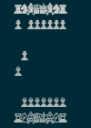

# Terra Chess

As part of Spacecamp 2021, Team Terra Chess presents....Terra Chess!

This repo is an early proof of concept for a blockchain based chess application that would form the backbone of a new community based Chess gaming protocol. 

-------------------------------

## Instructions for use

For now it's just using:
```
cargo test
```

However to see ASCII logos of what's going on, use:
```
cargo test -- --nocapture
```



----------------------------------------------

## Background

Spend your yields to defend your Terra Chess ranking, rank up to access stronger badges!
Pool your funds with your favorite chess club, federation, or broadcaster.
Terra Chess is a decentralized banking protocol for chess arenas and their communities. Arena supporters can earn yields by providing liquidity to public arena pools, and governing the ecosystem Oracle feeds. 

[Terra Chess Gitbook](https://11chadambrose.gitbook.io/terra-chess/) 

## Road map
### **Current Functionality**
* Starting and playing games of chess
* In game queries
* Leaderboard 

### **Planned Features**
* Staking with money and prize allocation
* Improved chess engine
* Web front end
* Gas reductions via more efficient code

### **Goals**
* Gasless interaction
* Coaching and Club deducations
* Spectator betting 

----------------------------------------------

## Contact 

We are Tim & Chad:
 - **Chad**: Overall concept, background and initial design
 - **Tim**: Smart contract design, engineering and implementation

More information can be found at: [Terra Chess Gitbook](https://11chadambrose.gitbook.io/terra-chess/) 
