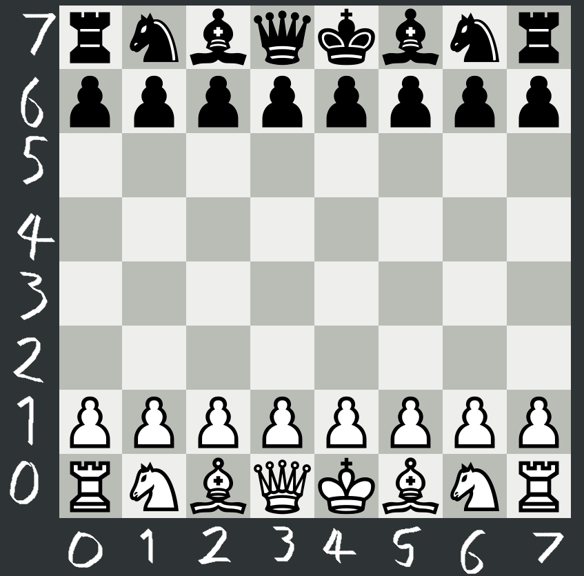

# Terra Chess

As part of Spacecamp 2021, Team Terra Chess presents....Terra Chess!

This repo is an early proof of concept for a blockchain based chess application that would form the backbone of a new community based Chess gaming protocol. 

-------------------------------
## Description

This repo contains all the rust code required to build a Bombay-10 compliant smart contract that allows users to play Chess via the Terra blockchain. 
As execution messages containing moves are sent to the contract, they are analysed against possible valid moves using a lightweight chess engine, and are then either rejected or commited to state storage. 

Eventually when checkmate or stalemate is achieved, the game is ended and deleted from stage storage.

This repo additionally contains a type script file to automate a quick game where the opponent is unfortunate enough to suffer the indignity of a *Scholar's Mate*, which can be verified by commenting out the last move.

I have additionally included a postman collection for some queries to inspect the contract if you're like me and find it easier to use.

Enjoy!

### Addresses

The following addresses viewable on Bombay-10:
- Contract Address: [terra1fydtl60hm63wkumpj2m06k93ztdnq2grphr0f0](https://finder.terra.money/bombay-10/address/terra1fydtl60hm63wkumpj2m06k93ztdnq2grphr0f0)
- Contract Store: [45BD1CD2475998CBD1A27D1AB8C89F71662FF99BA929EFDF25BD3B8CAA3F7929](https://finder.terra.money/bombay-10/tx/45BD1CD2475998CBD1A27D1AB8C89F71662FF99BA929EFDF25BD3B8CAA3F7929)
- Contract Instantiate: [FFA0016706C2E07F5E567C19D7FADFABF5676CCE6B353D4F80F62B57BB7589DD](https://finder.terra.money/bombay-10/tx/FFA0016706C2E07F5E567C19D7FADFABF5676CCE6B353D4F80F62B57BB7589DD)

-------------------------------

## Instructions for use

The contract has already been deployed to the Bombay-10 testnet. It can be interacted with by sending it messages defined in the `/schema/` folder, either by cli or otherwise. For example via the CLI you can run the following to start a new game between two wallet addresses:
```
terrad tx wasm execute terra1fydtl60hm63wkumpj2m06k93ztdnq2grphr0f0 '{"start_match":{"first_move":{"new":[3,3],"original":[3,1]},"opponent":"terra17lmam6zguazs5q5u6z5mmx76uj63gldnse2pdp"}}' --from testacc1 --chain-id=bombay-10 --fees=2000uluna --gas=auto --broadcast-mode=block
```
-------------------------------
The easiest way, however, is to simply run the type script file which will use hard-coded wallet addresses (with hopefully enough balance, if not top up at the [faucet](https://faucet.terra.money/)) to run through a series of moves that eventually lead to checkmate. 

*N.B The checkmate move has been commented out to allow you to query the game. Completed games are automatically removed from state storage to save space*

### Steps to run main.ts
1. Navigate to `../scripts`
2. Run `npm install`
3. Run `ts-node main.ts`
4. Current state of game can be queried via :
- CLI: 
``` 
terrad query wasm contract-store terra1fydtl60hm63wkumpj2m06k93ztdnq2grphr0f0 '{"CheckMatch":{"host":"terra1x46rqay4d3cssq8gxxvqz8xt6nwlz4td20k38v","opponent":"terra17lmam6zguazs5q5u6z5mmx76uj63gldnse2pdp"}}'
```
- Curl:
```
curl -X GET "https://lcd.terra.dev/wasm/contracts/terra1fydtl60hm63wkumpj2m06k93ztdnq2grphr0f0/store?query_msg=%7B%22CheckMatch%22%3A%7B%22host%22%3A%22terra17pwuad5t4th8tw39kyuwmcujty2mceevu6f7rf%22%2C%22opponent%22%3A%22terra1gqwlwpuaj9s9ncu2t88387zdr2z2a7zdm9c205%22%7D%7D" -H "accept: application/json"
```
- Postman: Collection can be found at: `../scripts/Terra LCD.postman_collection.json`
-------------------------------
To run unit tests for the rust contract, you can execute the following. With the additional flags you can also get a print out of what is actually being played too:
```
cargo test -- --nocapture
```
Finally the coordinates used to make chess moves are on a 0 -> 7 (x,y) coordinate format, which is different to the usual chess algaebraic notation. The engine does support both but only the former is enabled for now. You can use the chessboard below to help visualise what moves are being made:



----------------------------------------------


## Road map
### **Current Functionality**
* Starting games of chess and submitting moves
* In game queries
* Match end and valid move detection
* Playable via testnet, localterra or unit test

### **Planned Features**
* Leaderboard 
* Waiting lobby
* Staking with money and prize allocation
* Improved chess engine
* Web front end
* Gas reductions via more efficient code

### **Goals**
* Gasless interaction
* Coaching and Club deducations
* Spectator betting 

----------------------------------------------

## Background

Spend your yields to defend your Terra Chess ranking, rank up to access stronger badges!
Pool your funds with your favorite chess club, federation, or broadcaster.
Terra Chess is a decentralized banking protocol for chess arenas and their communities. Arena supporters can earn yields by providing liquidity to public arena pools, and governing the ecosystem Oracle feeds. 

----------------------------------------------

## Contact 

We are Tim & Chad:
 - **Chad**: Overall concept, background and initial design
 - **Tim**: Smart contract design, engineering and implementation

More information can be found at: [Terra Chess Gitbook](https://11chadambrose.gitbook.io/terra-chess/) 

## Acknowledgements
- Using *kalkins' chess library* on [github](https://github.com/kalkins/rust_chess) 
- Using *CosmWasm plus* on [github](https://github.com/CosmWasm/cw-plus)
- Using *larry0x's SpaceCamp workshop template* on [github](https://github.com/larry0x/spacecamp-2021-workshop)

